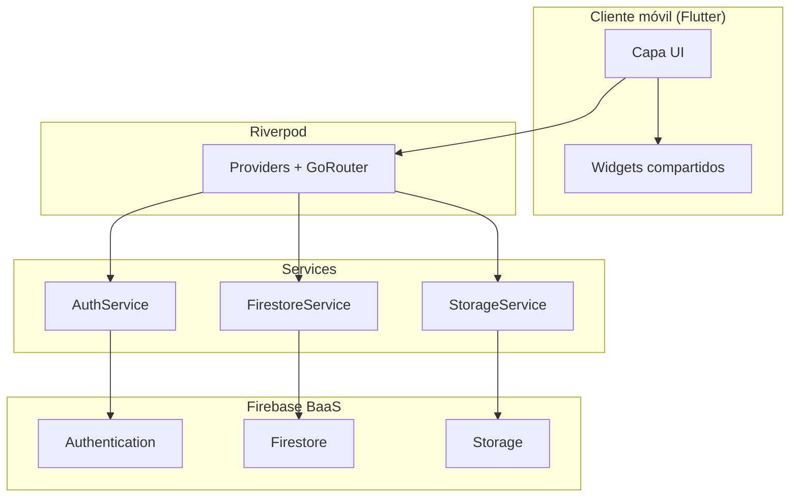

# Documentación Técnica — RiskMobile v1.0.0

**Proyecto académico · Computación Móvil 2026-1 · USC**  
**Equipo:** Kevin Cardoso · Brandon Faruck Villamarin  
**Repositorio:** [github.com/kesticar92/RiskMobile](https://github.com/kesticar92/RiskMobile)  
**Firebase:** `riskmobile-c59fc`  
**Fecha:** Mayo 2026

---

## 1. Resumen ejecutivo

RiskMobile es una aplicación móvil multiplataforma (Android/iOS) desarrollada con **Flutter 3.41** y **Firebase**, orientada a asesores financieros independientes y sus clientes. La plataforma permite realizar **preevaluaciones crediticias** sin consultar centrales de riesgo, calcular un **Score RiskMobile** propio (0–100), simular créditos con sliders interactivos, gestionar documentos, comunicarse por chat y llevar el control contable de comisiones.

La arquitectura sigue un patrón por capas: **UI (features) → Riverpod (estado) → Services → Firebase (BaaS)**. El proyecto implementa **16 pantallas**, **38 requerimientos funcionales** y **20 no funcionales**, con roles diferenciados Cliente y Asesor.

---

## 2. Arquitectura del sistema

### 2.1 Capas

| Capa | Ubicación | Responsabilidad |
|------|-----------|-----------------|
| **Presentación (UI)** | `lib/features/*/presentation/screens/` | Pantallas Material 3, formularios, navegación visual |
| **Estado** | Riverpod (`Provider`, `ConsumerWidget`) | Inyección de dependencias, router reactivo |
| **Servicios** | `lib/core/services/` | Auth, Firestore, Storage, preferencias locales |
| **Dominio** | `lib/shared/models/`, `lib/core/utils/` | Modelos de datos, `RiskCalculator`, formateadores |
| **Infraestructura** | Firebase SDK | Auth, Firestore, Storage vía HTTPS/TLS |

### 2.2 Diagrama de arquitectura

Ver diagrama completo en [diagramas/arquitectura.md](./diagramas/arquitectura.md).



### 2.3 Flujo de datos típico

1. El usuario interactúa con una pantalla (`ConsumerWidget`).
2. La pantalla invoca un servicio (`AuthService`, `FirestoreService`, etc.).
3. El servicio comunica con Firebase SDK.
4. Firestore/Auth responde; el servicio transforma datos a modelos Dart.
5. La UI se reconstruye vía streams o callbacks.

---

## 3. Stack tecnológico

| Componente | Tecnología | Versión |
|------------|------------|---------|
| Framework UI | Flutter | 3.41.4 |
| Lenguaje | Dart | 3.11.1 |
| Backend | Firebase (BaaS) | — |
| Base de datos | Cloud Firestore | 5.6.x |
| Autenticación | Firebase Auth + `local_auth` | 5.7.x / 2.3.x |
| Almacenamiento | Firebase Storage | 12.4.x |
| Estado | flutter_riverpod | 2.6.1 |
| Navegación | go_router | 14.8.1 |
| Tipografía | google_fonts (Inter) | 6.3.x |
| Animaciones | flutter_animate | 4.5.x |
| Gráficos | fl_chart | 0.70.x |
| Archivos | file_picker, image_picker | 8.x / 1.2.x |
| Compartir | share_plus | 10.1.x |
| Preferencias | shared_preferences | 2.5.x |
| URLs | url_launcher | 6.3.x |
| Compresión | image | 4.5.x |
| UI/UX | Material 3 | — |

---

## 4. Estructura del proyecto (`lib/`)

```
lib/
├── main.dart                          # Entry point, Firebase init, ProviderScope
├── firebase_options.dart              # Config Firebase por plataforma
├── core/
│   ├── constants/
│   │   ├── app_constants.dart         # Estados, pesos score, plantillas chat
│   │   └── credit_line_params.dart    # Parámetros por línea de crédito
│   ├── router/
│   │   ├── app_router.dart            # GoRouter — 16 rutas
│   │   └── navigation_helpers.dart    # Helpers de navegación
│   ├── services/
│   │   ├── auth_service.dart          # Registro, login, biometría
│   │   ├── firestore_service.dart     # CRUD casos, chat, comisiones, notif.
│   │   ├── storage_service.dart       # Subida documentos Firebase Storage
│   │   └── user_preferences.dart      # Preferencias locales (biometría, notif.)
│   ├── theme/
│   │   └── app_theme.dart             # Tema Material 3 RiskMobile
│   └── utils/
│       ├── formatters.dart            # Formato moneda, fechas es_CO
│       └── risk_calculator.dart         # Motor Score RiskMobile
├── features/
│   ├── auth/presentation/screens/     # Splash, Login, Register, Home, etc.
│   ├── interview/presentation/        # Entrevista 3 pasos
│   ├── documents/presentation/        # Carga documental
│   ├── calculator/presentation/       # Perfil financiero / Score
│   ├── simulator/presentation/        # Simulador dinámico
│   ├── advisor/presentation/          # CRM + detalle cliente
│   ├── chat/presentation/             # Chat asesor-cliente
│   ├── payments/presentation/         # Pagos consultas
│   ├── settings/presentation/         # Configuración
│   └── history/presentation/          # Historial evaluaciones
└── shared/
    ├── models/
    │   ├── user_model.dart
    │   └── financial_profile_model.dart
    └── widgets/
        ├── glass_card.dart
        ├── gradient_button.dart
        └── risk_score_widget.dart
```

**Total:** 34 archivos Dart en `lib/`.

---

## 5. Mapa de pantallas y rutas (GoRouter)

| # | Pantalla | Ruta | Archivo | Rol |
|---|----------|------|---------|-----|
| 1 | Splash | `/` | `splash_screen.dart` | Todos |
| 2 | Login | `/login` | `login_screen.dart` | Todos |
| 3 | Registro | `/register` | `register_screen.dart` | Todos |
| 4 | Recuperar contraseña | `/forgot-password` | `forgot_password_screen.dart` | Todos |
| 5 | Selección de rol | `/role-selection` | `role_selection_screen.dart` | Todos |
| 6 | Home Cliente | `/client-home` | `client_home_screen.dart` | Cliente |
| 7 | Entrevista financiera | `/interview` | `interview_screen.dart` | Cliente |
| 8 | Documentos | `/documents` | `documents_screen.dart` | Cliente |
| 9 | Perfil financiero (Score) | `/calculator` | `calculator_screen.dart` | Cliente |
| 10 | Simulador de crédito | `/simulator` | `simulator_screen.dart` | Cliente |
| 11 | Historial evaluaciones | `/evaluations-history` | `evaluations_history_screen.dart` | Cliente |
| 12 | CRM Asesor | `/advisor-dashboard` | `advisor_dashboard_screen.dart` | Asesor |
| 13 | Detalle de cliente | `/client-detail` | `client_detail_screen.dart` | Asesor |
| 14 | Chat | `/chat` | `chat_screen.dart` | Cliente / Asesor |
| 15 | Pagos | `/payments` | `payments_screen.dart` | Cliente |
| 16 | Configuración | `/settings` | `settings_screen.dart` | Todos |

**Router:** `lib/core/router/app_router.dart` — constantes en clase `AppRoutes`.

---

## 6. Modelo de datos Firestore

### 6.1 Colecciones principales

| Colección | Descripción | Campos clave |
|-----------|-------------|--------------|
| `users/{uid}` | Perfil de usuario | name, email, role, phone, createdAt |
| `cases/{caseId}` | Caso crediticio / entrevista | clientId, obligations[], riskScore, caseStatus |
| `cases/{caseId}/caseStatusHistory/{id}` | Trazabilidad de estados | previousStatus, newStatus, changedAt |
| `documents/{docId}` | Metadatos documentos | userId, caseId, downloadUrl, reviewStatus |
| `messages/{chatId}/chat/{msgId}` | Mensajes chat | senderId, content, timestamp |
| `notifications/{notifId}` | Notificaciones in-app | userId, title, body, read |
| `commissions/{commId}` | Comisiones asesor | advisorId, commissionAmount, profit |
| `payments/{paymentId}` | Pagos de servicios | userId, amount, status |

### 6.2 Diagrama ER

Ver [diagramas/firestore-er.md](./diagramas/firestore-er.md).

### 6.3 Modelo Dart principal

`FinancialProfileModel` (`lib/shared/models/financial_profile_model.dart`) mapea documentos de `cases` e incluye:
- Datos de entrevista (actividad, ingresos, obligaciones)
- Cálculos derivados (debtLevel, availableCapacity)
- Score y estado del caso
- Campos CRM del asesor (nota interna, prioridad, etiquetas, archivado, próximo seguimiento)

---

## 7. Servicios externos e integraciones

| Servicio | Paquete / SDK | Uso en RiskMobile |
|----------|---------------|-------------------|
| Firebase Authentication | `firebase_auth` | Registro, login, recuperar contraseña |
| Cloud Firestore | `cloud_firestore` | Perfiles, casos, chat, comisiones, notificaciones |
| Firebase Storage | `firebase_storage` | Documentos en `documents/{userId}/{caseId}/` |
| Biometría local | `local_auth` | Huella / Face ID post-login |
| Selector archivos | `file_picker`, `image_picker` | PDF, JPG, PNG; cámara y galería |
| Compartir enlaces | `share_plus` | Compartir downloadUrl de documentos (asesor) |
| Abrir URLs | `url_launcher` | WhatsApp, enlaces en historial |
| Preferencias | `shared_preferences` | Switches biometría y notificaciones |
| Compresión imagen | `image` | Reducción tamaño antes de subir (RF-B) |

**Proyecto Firebase:** `riskmobile-c59fc`  
**Inicialización:** `main.dart` → `Firebase.initializeApp(options: DefaultFirebaseOptions.currentPlatform)`

---

## 8. Seguridad

### 8.1 Firestore Rules (`firestore.rules`)

- **`users`:** lectura autenticada; escritura solo del propio uid.
- **`cases`:** lectura/escritura por dueño (`clientId`) o asesor (`role == advisor`).
- **`caseStatusHistory`:** creación solo asesor; lectura por participantes del caso.
- **`documents`:** creación cliente; actualización estado solo asesor.
- **`notifications`:** lectura/actualización solo del destinatario.
- **`messages`:** lectura/creación autenticada; sin update/delete.
- **`commissions`:** lectura/creación solo asesor propietario.

Funciones auxiliares: `isSignedIn()`, `isAdvisor()`, `ownsCase()`, `canAccessCaseData()`.

### 8.2 Storage Rules (`storage.rules`)

```
documents/{userId}/{caseId}/{fileName}
```
- Lectura y escritura solo si `request.auth.uid == userId`.

### 8.3 Roles

| Rol | Valor Firestore | Permisos |
|-----|-----------------|----------|
| Cliente | `client` | Sus casos, documentos, chat, simulador |
| Asesor | `advisor` | CRM completo, validación docs, estados, comisiones |

### 8.4 Otras medidas

- Contraseñas mín. 8 caracteres con letra y número (RNF06).
- Comunicaciones HTTPS/TLS (RNF02).
- Biometría como segundo factor local (RNF03).
- Score y evaluación **no sustituyen** consulta oficial en centrales.

---

## 9. Score RiskMobile — Fórmula

Implementado en `lib/core/utils/risk_calculator.dart`.

### 9.1 Variables ponderadas

| Variable | Peso | Fuente |
|----------|------|--------|
| Capacidad de pago | 40% | `(ingreso × 40% − cuotas) / ingreso` |
| Nivel de endeudamiento | 30% | `cuotas / ingreso` |
| Estabilidad laboral | 20% | Actividad económica + antigüedad |
| Historial declarado | 10% | 80 pts si tiene obligaciones; 60 si no |

### 9.2 Fórmula

```
Score = (Capacidad × 0.40) + (Endeudamiento × 0.30) + (Estabilidad × 0.20) + (Historial × 0.10)
```

Resultado: entero 0–100, redondeado.

### 9.3 Clasificación

| Rango | Etiqueta | Color |
|-------|----------|-------|
| 80–100 | Riesgo Bajo | Verde `#4CAF50` |
| 60–79 | Riesgo Medio | Naranja `#FF9800` |
| 40–59 | Riesgo Alto | Rojo `#F44336` |
| 0–39 | Riesgo Muy Alto | Morado `#9C27B0` |

### 9.4 Capacidad y simulador

```
Capacidad disponible = max(0, ingreso × 40% − total_cuotas)
Cuota mensual = P × r × (1+r)^n / ((1+r)^n − 1)
Monto máximo = capacidad × (1 − (1+r)^−n) / r
```

---

## 10. Limitaciones conocidas

| Área | Limitación |
|------|------------|
| Score | Orientativo; no consulta Datacrédito/TransUnion |
| OCR | No implementado; documentos no se analizan automáticamente |
| Pagos | Módulo de pagos sin pasarela real (PSE/tarjeta pendiente) |
| Offline | Sin sincronización offline; requiere conexión |
| Filtros CRM | Filtrado avanzado parcialmente en cliente; optimización server-side pendiente |
| iOS release | Requiere certificados Apple Developer para distribución App Store |
| Web | Biometría no disponible; file upload con limitaciones |
| Roles | Autorización fina por pantalla parcial (RF04) |
| Chat | Sin cifrado end-to-end adicional |
| Reglas Firestore | `messages` permite create amplio; endurecer en producción |

---

## 11. Cómo compilar el APK

### 11.1 Prerrequisitos

- Flutter SDK ≥ 3.0 (`flutter doctor`)
- Android SDK (API 34 recomendado)
- JDK 17+
- Archivo `android/app/google-services.json` configurado

### 11.2 Compilación release (recomendada)

```bash
cd /ruta/al/proyecto/riskmobile
flutter clean
flutter pub get
flutter build apk --release
```

**Salida:** `build/app/outputs/flutter-apk/app-release.apk`

**Copiar a releases:**

```bash
cp build/app/outputs/flutter-apk/app-release.apk releases/RiskMobile-v1.0.0.apk
```

### 11.3 Nota sobre rutas con espacios

Si Gradle falla al compilar en rutas con espacios (p. ej. `Feb - Jun 2026`), copiar el proyecto a una ruta sin espacios:

```bash
mkdir -p ~/Projects/riskmobile
rsync -a --exclude '.dart_tool' --exclude 'build' --exclude '.git' \
  "/ruta/con espacios/riskmobile/" ~/Projects/riskmobile/
cd ~/Projects/riskmobile
flutter clean && flutter pub get && flutter build apk --release
```

Luego copiar el APK generado de vuelta a `releases/` del repo de trabajo.

### 11.4 APK debug (fallback)

Si release falla tras intentos razonables:

```bash
flutter build apk --debug
# Salida: build/app/outputs/flutter-apk/app-debug.apk
```

Documentar el error en esta sección. Build release **v1.0.0** compilado exitosamente el **22/05/2026** desde la ruta del workspace (60.6 MB).

### 11.5 Instalación en dispositivo

```bash
adb install releases/RiskMobile-v1.0.0.apk
```

---

## 12. Referencias

- [README.md](../README.md) — Descripción general y requerimientos
- [COMO_EJECUTAR.md](../COMO_EJECUTAR.md) — Guía de ejecución y pruebas
- [RESUMEN_ENTREGABLE.md](../RESUMEN_ENTREGABLE.md) — Historial de implementación
- [MANUAL_USUARIO.md](./manual/MANUAL_USUARIO.md) — Manual paso a paso
- [REGLAS_DOCUMENTOS_FIRESTORE.md](./REGLAS_DOCUMENTOS_FIRESTORE.md) — Reglas documentales

---

**Desarrollado por Kevin Cardoso y Brandon Faruck Villamarin · USC · 2026**
