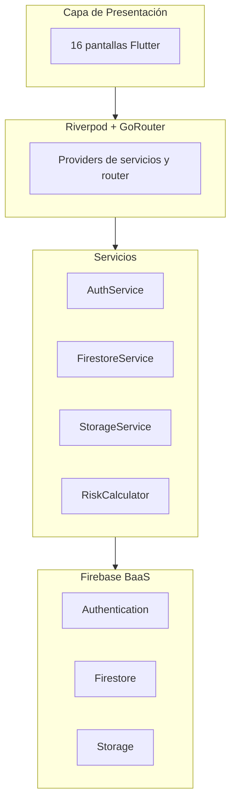

# Documentación técnica — RiskMobile v1.0.0

**Proyecto académico** — Computación Móvil 2026-1 · Universidad  
**Repositorio:** [github.com/kesticar92/RiskMobile](https://github.com/kesticar92/RiskMobile)  
**Firebase:** `riskmobile-c59fc`  
**Equipo:** Kevin Cardoso · Brandon Faruck Villamarin

---

## 1. Resumen ejecutivo

RiskMobile es una aplicación móvil multiplataforma (Android/iOS) desarrollada con **Flutter** y **Firebase** que permite realizar **preevaluaciones crediticias** sin generar consultas en centrales de riesgo. Conecta a **clientes** interesados en conocer su viabilidad financiera con **asesores financieros independientes** que gestionan casos, documentos, comunicación y comisiones.

La plataforma integra en un solo flujo:

- Entrevista financiera digital (3 pasos)
- Motor de evaluación con **Score RiskMobile** (0–100)
- Simulador dinámico de crédito
- Carga y validación documental
- CRM del asesor con filtros avanzados
- Chat en tiempo real asesor–cliente
- Panel de comisiones y utilidades

**Estado de entrega:** 16 pantallas implementadas, 38 requerimientos funcionales documentados (mayoría operativos), APK release compilado en `releases/RiskMobile-v1.0.0.apk`.

---

## 2. Arquitectura del sistema

La aplicación sigue una arquitectura en capas con separación clara de responsabilidades:

```
UI (Screens/Widgets)
    ↓
Estado (Riverpod Providers)
    ↓
Servicios (Auth, Firestore, Storage)
    ↓
Firebase (Auth, Firestore, Storage) + Plugins nativos
```

### Descripción por capa

| Capa | Responsabilidad | Ubicación |
|------|-----------------|-----------|
| **Presentación** | Pantallas, widgets reutilizables, animaciones | `lib/features/*/presentation/` |
| **Estado** | Providers Riverpod, router GoRouter | `lib/core/router/`, providers en servicios |
| **Servicios** | Lógica de negocio, acceso a Firebase | `lib/core/services/` |
| **Modelos** | Entidades de datos tipadas | `lib/shared/models/` |
| **Utilidades** | Cálculos financieros, formateo | `lib/core/utils/` |
| **Constantes** | Catálogos, pesos del score, colecciones | `lib/core/constants/` |

### Diagrama de arquitectura

Ver archivo Mermaid: [`diagramas/arquitectura.mmd`](diagramas/arquitectura.mmd)



---

## 3. Stack tecnológico

| Componente | Tecnología | Versión / Notas |
|------------|------------|-----------------|
| Framework | Flutter | 3.41.x |
| Lenguaje | Dart | SDK ^3.0.0 |
| Backend | Firebase (BaaS) | Proyecto `riskmobile-c59fc` |
| Autenticación | Firebase Auth + `local_auth` | Correo/contraseña + biometría |
| Base de datos | Cloud Firestore | NoSQL, tiempo real |
| Almacenamiento | Firebase Storage | Documentos por usuario/caso |
| Estado | `flutter_riverpod` | ^2.6.1 |
| Navegación | `go_router` | ^14.8.1, 16 rutas |
| UI | Material 3 + Google Fonts (Inter) | `flutter_animate`, `fl_chart` |
| Documentos | `image_picker`, `file_picker`, `image` | Cámara, galería, PDF, compresión |
| Compartir | `share_plus`, `url_launcher` | Enlaces de documentos, WhatsApp |
| Persistencia local | `shared_preferences` | Preferencias de biometría y notificaciones |

---

## 4. Estructura de carpetas `lib/`

```
lib/
├── main.dart                          # Punto de entrada, Firebase.initializeApp()
├── firebase_options.dart              # Configuración Firebase por plataforma
├── core/
│   ├── constants/
│   │   ├── app_constants.dart         # Catálogos, pesos score, colecciones Firestore
│   │   └── credit_line_params.dart    # Parámetros por línea de crédito
│   ├── router/
│   │   ├── app_router.dart            # GoRouter — 16 rutas
│   │   └── navigation_helpers.dart
│   ├── services/
│   │   ├── auth_service.dart          # Registro, login, biometría, logout
│   │   ├── firestore_service.dart     # CRUD casos, chat, comisiones, notificaciones
│   │   ├── storage_service.dart       # Subida de documentos a Firebase Storage
│   │   └── user_preferences.dart      # Preferencias locales
│   ├── theme/
│   │   └── app_theme.dart             # Tema Material 3 RiskMobile
│   └── utils/
│       ├── risk_calculator.dart       # Motor Score RiskMobile y fórmulas crediticias
│       └── formatters.dart            # Formato moneda, fechas
├── features/
│   ├── auth/presentation/screens/     # Splash, Login, Register, ForgotPassword, RoleSelection, ClientHome
│   ├── interview/presentation/screens/ # Entrevista financiera (3 pasos)
│   ├── documents/presentation/screens/ # Carga documental
│   ├── calculator/presentation/screens/  # Perfil financiero / Score
│   ├── simulator/presentation/screens/   # Simulador de crédito
│   ├── history/presentation/screens/     # Historial de evaluaciones
│   ├── advisor/presentation/screens/     # CRM y detalle de cliente
│   ├── chat/presentation/screens/        # Chat asesor-cliente
│   ├── payments/presentation/screens/    # Comisiones y panel financiero
│   └── settings/presentation/screens/    # Configuración
└── shared/
    ├── models/
    │   ├── user_model.dart
    │   └── financial_profile_model.dart
    └── widgets/
        ├── risk_score_widget.dart
        ├── gradient_button.dart
        └── glass_card.dart
```

---

## 5. Mapa de pantallas y rutas (16 pantallas)

Definidas en `lib/core/router/app_router.dart`:

| # | Ruta | Pantalla | Rol | Descripción |
|---|------|----------|-----|-------------|
| 1 | `/` | SplashScreen | Ambos | Logo, barra de progreso, redirección según sesión |
| 2 | `/login` | LoginScreen | Ambos | Correo, contraseña, biometría, enlace registro |
| 3 | `/register` | RegisterScreen | Ambos | Registro con selector Cliente/Asesor |
| 4 | `/forgot-password` | ForgotPasswordScreen | Ambos | Recuperación de contraseña vía Firebase |
| 5 | `/role-selection` | RoleSelectionScreen | Ambos | Selección de rol (flujo alternativo) |
| 6 | `/client-home` | ClientHomeScreen | Cliente | Home con accesos a entrevista, documentos, chat |
| 7 | `/interview` | InterviewScreen | Cliente | Entrevista financiera (3 pasos) |
| 8 | `/documents` | DocumentsScreen | Cliente | Carga cámara/galería/archivo, reintentos |
| 9 | `/calculator` | CalculatorScreen | Cliente | Perfil financiero, Score, endeudamiento |
| 10 | `/simulator` | SimulatorScreen | Cliente | Simulador con sliders tasa/plazo/monto |
| 11 | `/evaluations-history` | EvaluationsHistoryScreen | Cliente | Historial de evaluaciones y documentos por caso |
| 12 | `/advisor-dashboard` | AdvisorDashboardScreen | Asesor | CRM: métricas, búsqueda, filtros avanzados |
| 13 | `/client-detail` | ClientDetailScreen | Asesor | Perfil completo, estado, documentos, notas |
| 14 | `/chat` | ChatScreen | Ambos | Mensajería en tiempo real (máx. 500 caracteres) |
| 15 | `/payments` | PaymentsScreen | Asesor | Registro de comisiones y panel financiero |
| 16 | `/settings` | SettingsScreen | Ambos | Notificaciones, biometría, cerrar sesión |

**Parámetros de navegación:**

- `/documents`, `/calculator`, `/simulator`: reciben `caseId` o `profileId` vía `state.extra`.
- `/client-detail`: recibe `profileId` (ID del caso).
- `/chat`: recibe mapa `{ otherUserId, otherUserName, caseId? }`.

---

## 6. Modelo de datos Firestore

### Colecciones principales

| Colección | Propósito |
|-----------|-----------|
| `users` | Perfil de usuario (nombre, email, rol, teléfono) |
| `cases` | Casos crediticios / perfiles financieros |
| `cases/{id}/caseStatusHistory` | Trazabilidad de cambios de estado |
| `documents` | Metadatos de documentos subidos |
| `messages/{chatId}/chat` | Mensajes del chat |
| `commissions` | Comisiones del asesor |
| `notifications` | Notificaciones in-app |
| `payments` | Registro de pagos (consultas especializadas) |

### Diagrama entidad-relación

Ver archivo Mermaid: [`diagramas/firestore-er.mmd`](diagramas/firestore-er.mmd)

### Campos clave de `cases`

| Campo | Tipo | Descripción |
|-------|------|-------------|
| `clientId` | string | UID del cliente |
| `economicActivity` | string | Empleado, Pensionado, etc. |
| `monthlyIncome` | number | Ingreso mensual declarado |
| `obligations` | array | Obligaciones financieras |
| `totalMonthlyPayments` | number | Suma de cuotas |
| `debtLevel` | number | Ratio endeudamiento (0–1) |
| `availableCapacity` | number | Capacidad para nueva cuota |
| `desiredAmount` | number | Monto deseado |
| `riskScore` | number | Score RiskMobile (0–100) |
| `caseStatus` | string | Estado del caso (6 valores) |
| `advisorInternalNote` | string | Nota interna del asesor |
| `casePriority` | boolean | Prioridad alta |
| `caseArchived` | boolean | Caso archivado |
| `caseTags` | array | Etiquetas (máx. 8) |
| `nextFollowUpAt` | timestamp | Próximo seguimiento |

---

## 7. Servicios externos e integraciones

### Firebase Authentication

- Registro e inicio de sesión con correo/contraseña
- Recuperación de contraseña por email
- Sesión persistente entre reinicios

### Cloud Firestore

- Streams en tiempo real para CRM, chat, notificaciones y documentos
- Subcolecciones para historial de estados y mensajes

### Firebase Storage

- Ruta: `documents/{userId}/{caseId}/{fileName}`
- Metadatos persistidos en colección `documents`

### Plugins nativos

| Plugin | Uso |
|--------|-----|
| `local_auth` | Huella / Face ID (solo dispositivo físico) |
| `image_picker` | Cámara y galería |
| `file_picker` | Selección de PDF/imagen |
| `image` | Compresión de imágenes antes de subir |
| `share_plus` | Compartir URL de documentos |
| `url_launcher` | Abrir enlaces, WhatsApp |

---

## 8. Seguridad

### Reglas Firestore (`firestore.rules`)

| Recurso | Regla |
|---------|-------|
| `users/{userId}` | Lectura autenticada; escritura solo del dueño |
| `cases/{caseId}` | Cliente lee/escribe sus casos; asesor lee/actualiza todos |
| `caseStatusHistory` | Lectura por participantes del caso; creación solo asesor |
| `documents/{docId}` | Cliente crea los suyos; asesor lee y actualiza estado |
| `notifications` | Solo el destinatario (`userId`) |
| `messages/.../chat` | Lectura/creación autenticada; sin edición/borrado |
| `commissions` | Solo el asesor dueño (`advisorId`) |

Funciones auxiliares: `isAdvisor()`, `ownsCase()`, `canAccessCaseData()`.

Ver también: [`REGLAS_DOCUMENTOS_FIRESTORE.md`](REGLAS_DOCUMENTOS_FIRESTORE.md)

### Roles

| Rol | Valor Firestore | Permisos |
|-----|-----------------|----------|
| Cliente | `client` | Entrevista, documentos, simulador, chat con asesor |
| Asesor | `advisor` | CRM, detalle cliente, cambio estado, revisión documentos, comisiones |

### Autenticación multifactor

Correo/contraseña + biometría opcional (`local_auth`) configurada en Settings.

---

## 9. Score RiskMobile — Fórmula

> **Aviso legal:** El Score RiskMobile es un indicador **informativo y orientativo** basado en datos declarados por el usuario. **No reemplaza** el score de centrales de riesgo (Datacrédito, TransUnion, etc.).

### Variables ponderadas

| Variable | Peso | Fuente |
|----------|------|--------|
| Capacidad de pago | 40% | `(ingreso × 40% − cuotas) / ingreso` |
| Nivel de endeudamiento | 30% | `cuotas / ingreso` |
| Estabilidad laboral | 20% | Actividad económica + antigüedad |
| Historial financiero | 10% | ¿Tiene obligaciones declaradas? |

### Fórmula

```
Score = (Capacidad × 0.40) + (Endeudamiento × 0.30) + (Estabilidad × 0.20) + (Historial × 0.10)
```

Implementación: `lib/core/utils/risk_calculator.dart`

### Clasificación

| Rango | Clasificación | Color |
|-------|---------------|-------|
| 80–100 | Riesgo Bajo | Verde `#4CAF50` |
| 60–79 | Riesgo Medio | Naranja `#FF9800` |
| 40–59 | Riesgo Alto | Rojo `#F44336` |
| 0–39 | Riesgo Muy Alto | Morado `#9C27B0` |

### Fórmulas crediticias adicionales

```
Cuota mensual = P × r × (1+r)^n / ((1+r)^n − 1)
Monto máximo  = Capacidad × (1 − (1+r)^−n) / r
Endeudamiento = (Total cuotas / Ingresos) × 100
Capacidad     = max(0, Ingresos × 40% − Total cuotas)
```

---

## 10. Limitaciones conocidas

| Área | Limitación |
|------|------------|
| Score | No consulta centrales de riesgo reales; es indicador interno |
| Biometría | No disponible en web ni emulador |
| Roles | Autorización fina por pantalla parcial (RF04) |
| Filtros CRM | Algunos filtros avanzados son client-side |
| Pagos | Módulo de cobro de consultas sin pasarela real integrada |
| OCR | No implementado; documentos se revisan manualmente |
| Offline | Sin sincronización offline |
| iOS | APK entregado; build iOS requiere Mac + certificados Apple |
| Chat | Sin cifrado end-to-end adicional |
| Asesor único | Cliente conecta al primer asesor encontrado en Firestore |

---

## 11. Cómo compilar el APK

### Prerrequisitos

- Flutter SDK ≥ 3.0 (`flutter doctor`)
- Android SDK (Android Studio)
- Archivo `android/app/google-services.json` del proyecto Firebase

### Compilación desde ruta sin espacios (recomendado)

Si la ruta del proyecto contiene espacios (p. ej. `Feb - Jun 2026`), copiar a una ruta limpia:

```bash
mkdir -p ~/Projects
rsync -a --exclude '.git' --exclude 'build' --exclude '.dart_tool' \
  "/ruta/con espacios/riskmobile/" ~/Projects/riskmobile/
cd ~/Projects/riskmobile
flutter clean
flutter pub get
flutter build apk --release
```

### Resultado del build (22/05/2026)

| Campo | Valor |
|-------|-------|
| Estado | **Exitoso** |
| Comando | `flutter build apk --release` |
| Salida Gradle | `build/app/outputs/flutter-apk/app-release.apk` |
| Tamaño | ~60.6 MB |
| Copia en repo | `releases/RiskMobile-v1.0.0.apk` |
| Flutter | 3.41.4 stable |
| Tiempo build | ~155 s |

### Instalación en dispositivo

```bash
adb install releases/RiskMobile-v1.0.0.apk
```

> En el entorno de compilación no había `adb` ni dispositivo conectado; la instalación debe verificarse localmente.

### Build alternativo (debug)

```bash
flutter build apk --debug
# Salida: build/app/outputs/flutter-apk/app-debug.apk
```

### Ejecución en desarrollo

```bash
flutter pub get
flutter run                    # Android/emulador
flutter run -d chrome          # Web (sin biometría)
```

Ver también: [`COMO_EJECUTAR.md`](../COMO_EJECUTAR.md)

---

## 12. Referencias

- [`README.md`](../README.md) — Documentación general del proyecto
- [`COMO_EJECUTAR.md`](../COMO_EJECUTAR.md) — Guía de ejecución y demo
- [`RESUMEN_ENTREGABLE.md`](../RESUMEN_ENTREGABLE.md) — Entregable conexión BD
- [`RESUMEN_PARA_EXPOSICION_RAMOS.md`](../RESUMEN_PARA_EXPOSICION_RAMOS.md) — Detalle por RF y ramas
- [`firestore.rules`](../firestore.rules) — Reglas de seguridad Firestore
- [`manual/MANUAL_USUARIO.md`](manual/MANUAL_USUARIO.md) — Manual para usuarios finales
