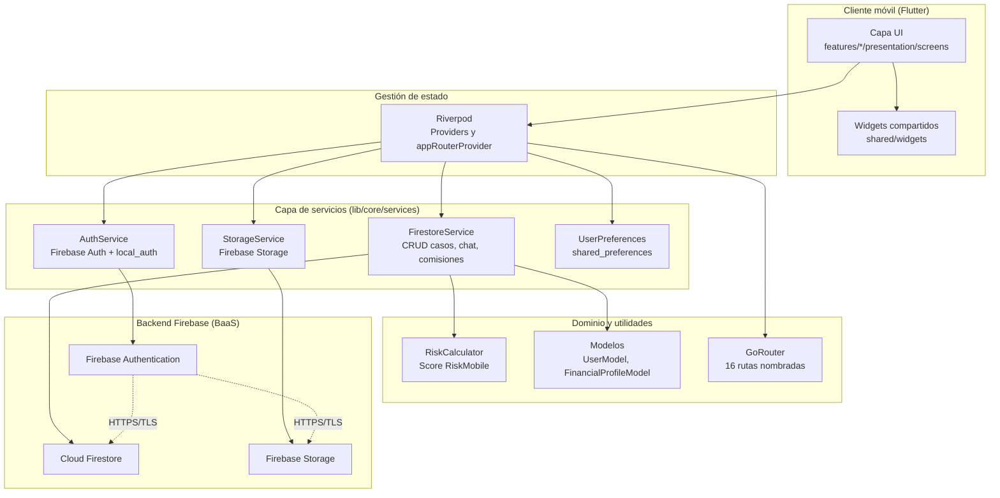

# Diagrama de arquitectura — RiskMobile

Diagrama de capas: UI → Riverpod → Services → Firebase.

```mermaid
flowchart TB
    subgraph Cliente["Cliente móvil (Flutter)"]
        UI["Capa UI<br/>features/*/presentation/screens"]
        Widgets["Widgets compartidos<br/>shared/widgets"]
        UI --> Widgets
    end

    subgraph Estado["Gestión de estado"]
        RP["Riverpod<br/>Providers y appRouterProvider"]
    end

    subgraph Servicios["Capa de servicios (lib/core/services)"]
        AuthS["AuthService<br/>Firebase Auth + local_auth"]
        FSS["FirestoreService<br/>CRUD casos, chat, comisiones"]
        StorS["StorageService<br/>Firebase Storage"]
        Prefs["UserPreferences<br/>shared_preferences"]
    end

    subgraph Dominio["Dominio y utilidades"]
        RC["RiskCalculator<br/>Score RiskMobile"]
        Models["Modelos<br/>UserModel, FinancialProfileModel"]
        Router["GoRouter<br/>16 rutas nombradas"]
    end

    subgraph Firebase["Backend Firebase (BaaS)"]
        Auth["Firebase Authentication"]
        FS["Cloud Firestore"]
        ST["Firebase Storage"]
    end

    UI --> RP
    RP --> Router
    RP --> AuthS
    RP --> FSS
    RP --> StorS
    RP --> Prefs
    FSS --> RC
    FSS --> Models

    AuthS --> Auth
    FSS --> FS
    StorS --> ST

    Auth -.->|"HTTPS/TLS"| FS
    Auth -.->|"HTTPS/TLS"| ST
```

**Fuente editable:** [arquitectura.mmd](./arquitectura.mmd)
